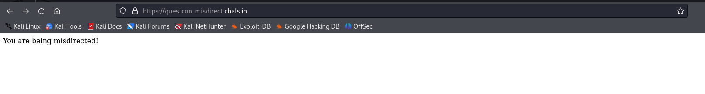
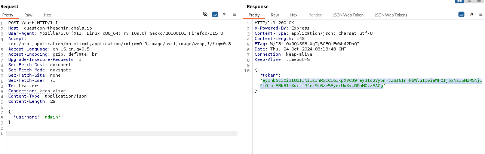
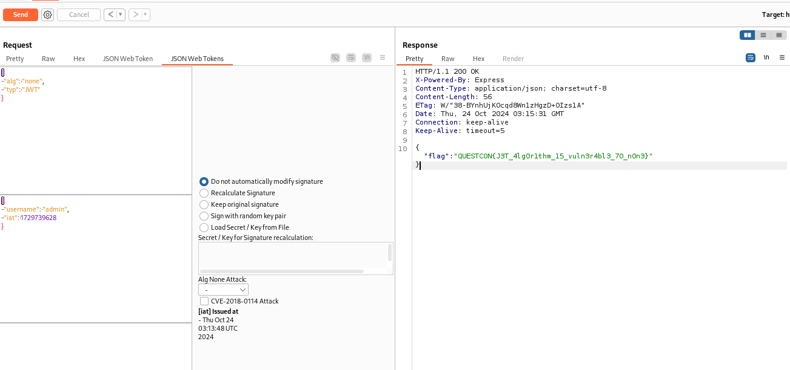
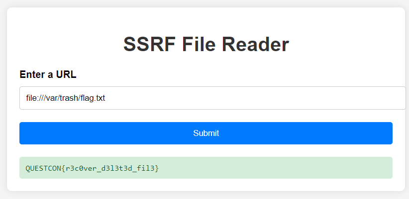
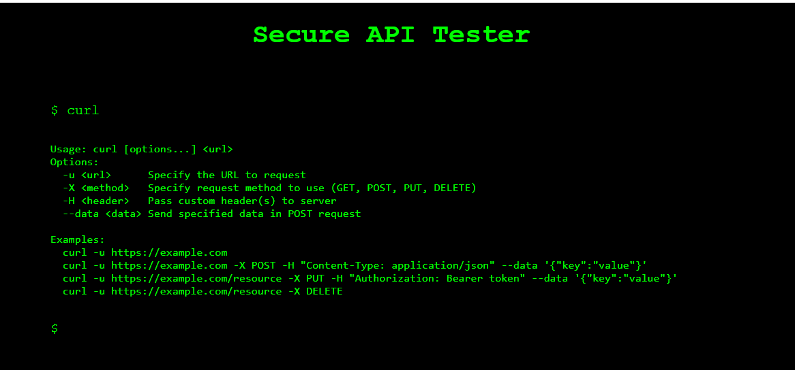
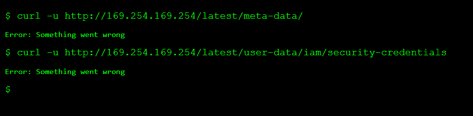
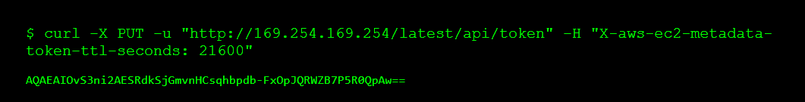
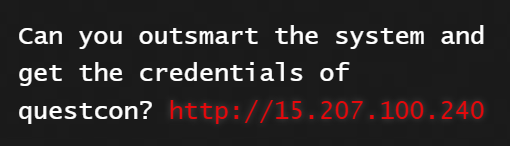
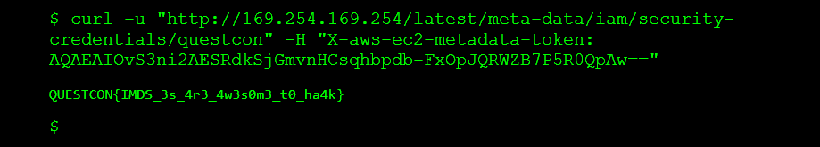

# solution

## DIRECTION

<br>
It's open with this content, so firstly when do a black box, i check **/robots.txt** and i saw **/start**. It cant run with get, so i change to post request.

1. **X-Flag-Part: QUESTC** focus on this part of reponse, continue follow redirection in burp reapeater. X-Flag-Part: ON{mi3 -> X-Flag-Part: d1r3ct -> X-Flag-Part: 10n_15 -> X-Flag-Part: \_4n_4r.
2. Final flag is: Flag: QUESTCON{mi3d1r3ct10n_15_4n_4r}

## Theadmin

1. i send a post request like this to server
   <br>
2. Then i send a get request with that jwt token but i just receive, Hello welcome admin
3. After thinking a bit, i think that the description not lie to us. Cause we have jwt so i guess it some kinds of jwt vulnerabilities. So try from ez to hard jwt payloads.
4. Luckily, it show the flag when we change alg to none, remember choose **alg none attack** to alg none. You can download this extensions by go to burp shop then search by there name on the title
   <br>

## Temp

This challenge is quite tricky for me, i try file:///etc/passwd, file:///tmp/flag.txt, file:///var/flag.txt. But i dont get anything. Luckily, when i saw a writeup they give me this dir var/trash/flag.txt
<br>
Its black box bro, very frustrating when do this challenge.

**Bonus** : the server use flask so in common they have a file call **app.py**. And you can put this payload

```
file://app.py
```

You will question what the different between file:// and file:///. Well, as i know, file:/// will search from the root of local, for example flag.txt is located at root/var/flag.txt, I just need to enter file:///var/flag.txt. And file:// will search for the file on a remote server, for example if I enter file://localhost/var/flag.txt, it will search for the remote server localhost and find the file flag.txt.

The valid format is file:///etc/passwd or file://localhost/etc/passwd. The reason why file://app.py worked this time is because it happened to be implemented that way for some reason.
<br>

## WHoIAM

first of all, i find that we can only use **ls, pwd, whoami,curl** command. Seem we had no choice to read flag.txt. Hmm, curl command show us something.
<br>
Hmm it looks like aws ssrf (use curl to retrive the data)
After searching, i find payloads for IMDSv2 and IMDSv1 (Instance Metadata Service v2 and Instance Metadata Service v1). Here is some reference

1. For IMDSv2: https://blog.appsecco.com/server-side-request-forgery-ssrf-and-aws-ec2-instances-after-instance-meta-data-service-version-38fc1ba1a28a , https://blog.appsecco.com/getting-started-with-version-2-of-aws-ec2-instance-metadata-service-imdsv2-2ad03a1f3650

2. For IMDSv1: https://scalesec.com/blog/exploit-ssrf-to-gain-aws-credentials/

3. For more information: https://hackingthe.cloud/aws/exploitation/ec2-metadata-ssrf/ (you need to get the credentials so you should use this payload in the link)

<br>
Hmm, i try payloads for IMDSv1 but its not working. So try IMDSv2 payload.
<br>
Hmm, i get the token. Just a information for you **Amazon has introduced IMDS v2 for prevention of ssrf vulnerabilities, but in this case you were able to make a PUT request against which you can issue a token, as shown in the above image. From the old endpoints of IMDS service you can get the flag**
<br>
Look at the challenge's title, we need to get the credentials of questcon. So next we put this payload.

```
curl -u "http://169.254.169.254/latest/meta-data/iam/security-credentials/questcon" -H "X-aws-ec2-metadata-token: AQAEAIOvS3ni2AESRdkSjGmvnHCsqhbpdb-FxOpJQRWZB7P5R0QpAw=="
```

<br>
