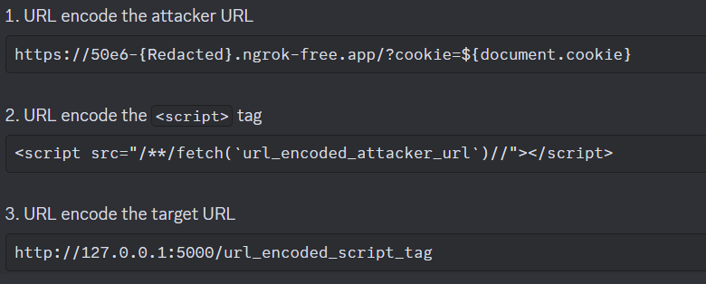

# first of all, i didn't solve this challenge by myself, i read from siunam who is quite impress person for me, he solved challenges in detail.

here is the link he solve: https://siunam321.github.io/ctf/SekaiCTF-2024/Web/Tagless/

Like a newbie in ctf i think i can conclude sth that others newbie like me can more fully understand:

1. {sth} this type of sign is related to XSS or maybe SSTI
2. You need to url encode 3 times in this challenge:
    
