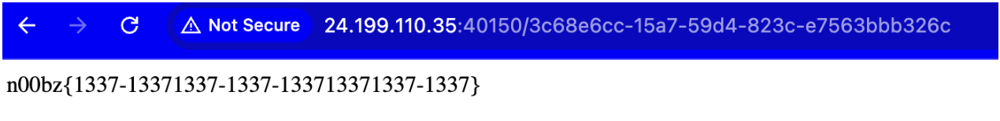

# Thought to solve

# passwordless

## thingking path

code from source code:

```
#!/usr/bin/env python3
from flask import Flask, request, redirect, render_template, render_template_string
import subprocess
import urllib
import uuid
global leet

app = Flask(**name**)
flag = open('/flag.txt').read()
leet=uuid.UUID('13371337-1337-1337-1337-133713371337')

@app.route('/',methods=['GET','POST'])
def main():
global username
if request.method == 'GET':
return render_template('index.html')
elif request.method == 'POST':
username = request.values['username']
if username == 'admin123':
return 'Stop trying to act like you are the admin!'
uid = uuid.uuid5(leet,username) # super secure!
return redirect(f'/{uid}')

@app.route('/<uid>')
def user_page(uid):
if uid != str(uuid.uuid5(leet,'admin123')):
return f'Welcome! No flag for you :('
else:
return flag

if **name** == '**main**':
app.run(host='0.0.0.0', port=1337)
```

When we look at the code, we see to get flag, we need to login with right url made from _str(uuid.uuid5(leet,'admin123')_ . However, we only can access the flag with admin123 UUID but we can't use the username admin123. Luckily we can just create uuid manually.

```
import uuid
leet=uuid.UUID('13371337-1337-1337-1337-133713371337')
uid = uuid.uuid5(leet,"admin123")
print(uid)
UUID('3c68e6cc-15a7-59d4-823c-e7563bbb326c')
```

and get the flag


